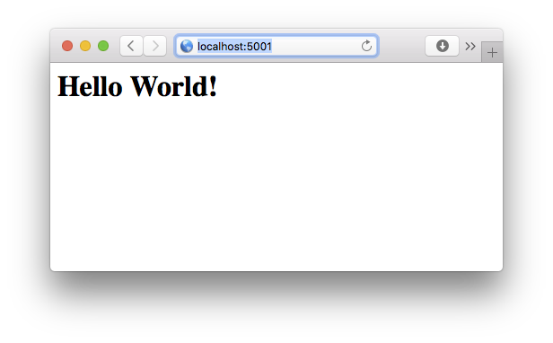

# Hello World

This is just a hello-world service in order to check if the docker environment is working. It uses nginx to serve a static html file.



## Usage

In order to try this out, start the `hello_world` service and visit http://localhost:5001.

```bash
cd wingolfsplattform-docker
docker-compose up hello_world
```